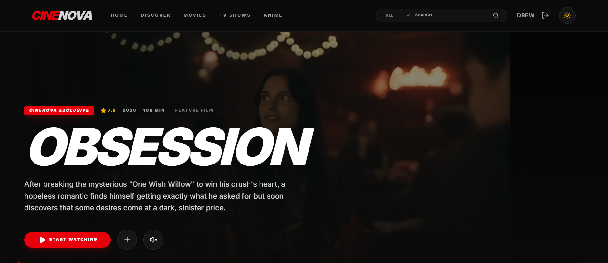

# CineNova

CineNova is a modern movie and TV discovery web application built with **Next.js (App Router)**, **TypeScript**, and **Supabase**. It integrates the **TMDB API** to provide real-time movie and TV data, including trending titles, detailed information, and search functionality.

The project features a responsive UI, dark mode support, and a smooth user experience optimized for both desktop and mobile devices.

---

## 🎬 Preview



---

## 🚀 Getting Started

### Prerequisites

Make sure you have the following installed:

- Node.js 18 or higher
- npm, yarn, or pnpm

---

### Installation

Clone the repository and install dependencies:

```bash
git clone https://github.com/your-username/cinenova.git
cd cinenova
npm install